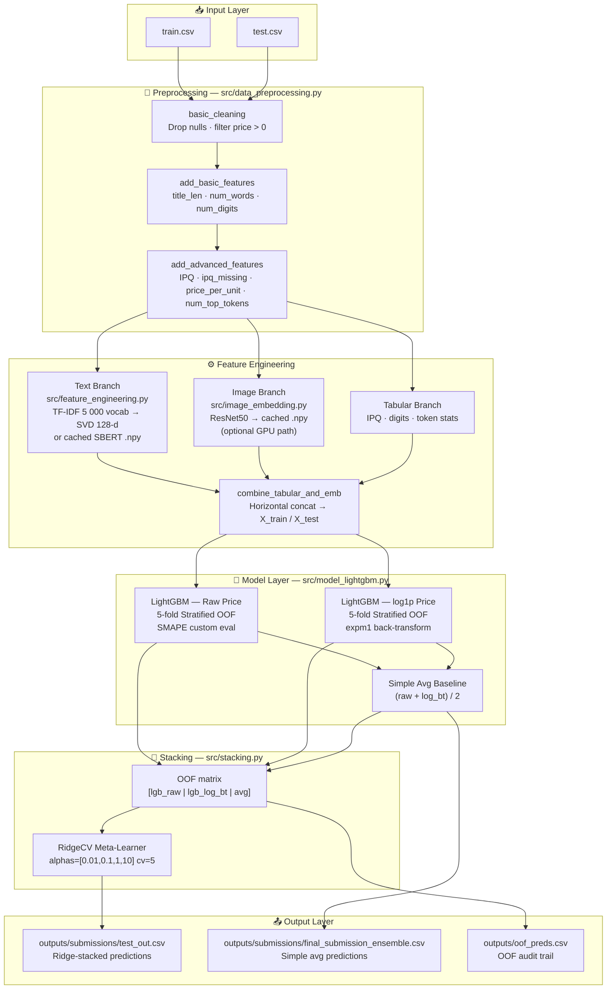
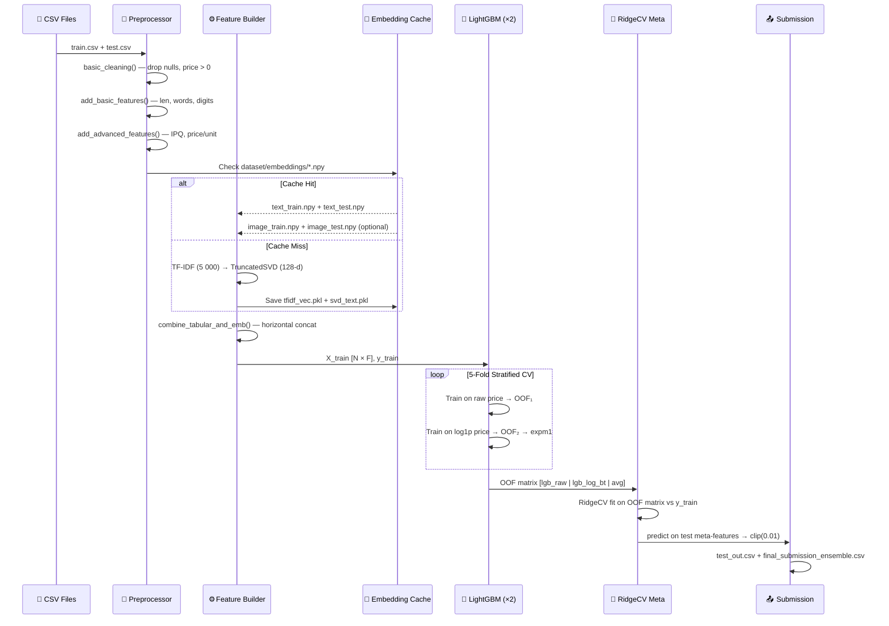

# 🛒 PriceWise ML

> **Multimodal ML pipeline** — predicts optimal e-commerce product prices by fusing text semantics, image features, and engineered tabular signals through a LightGBM + RidgeCV stacking ensemble, optimised with the SMAPE metric.

## 🔍 Overview

The pipeline ingests raw product catalogue CSV files and produces a price-prediction submission CSV. It supports three modalities:

| Modality | Source | Representation |
|---|---|---|
| **Text** | `catalog_content` | TF-IDF → TruncatedSVD (128-d) *or* cached SBERT (384-d) |
| **Image** | Product image URLs | Cached ResNet50 embeddings (optional) |
| **Tabular** | Structured title signals | IPQ, price-per-unit, token counts, digit stats |

The three modalities are horizontally concatenated and fed into a **two-stage ensemble**: two LightGBM models (raw price & log₁p-transformed price) whose out-of-fold predictions are blended by a **RidgeCV meta-learner**.

---

## 🏗️ System Architecture



---

## 🔄 Data Flow



---

## 📁 Project Structure

```
Smart-Product-Pricing-Challenge-ML2025/
│
├── train.py                    # Main entrypoint — orchestrates full pipeline
├── requirements.txt            # Python dependencies
│
├── config/
│   └── config.yaml             # Seed, folds, TF-IDF & SVD dimensions
│
├── dataset/
│   ├── train.csv               # Training data (~74 MB)
│   ├── test.csv                # Test data (~74 MB)
│   ├── sample_test.csv         # Quick-smoke sample
│   ├── sample_test_out.csv     # Expected sample output
│   └── embeddings/             # Auto-created cache dir (*.npy files)
│
├── src/
│   ├── data_preprocessing.py   # Cleaning + basic & advanced feature extraction
│   ├── feature_engineering.py  # TF-IDF/SVD text pipeline + feature combiner
│   ├── advanced_features.py    # IPQ parser, price-per-unit, top-token count
│   ├── model_lightgbm.py       # LightGBM OOF trainer with SMAPE eval
│   ├── stacking.py             # RidgeCV meta-learner utility
│   ├── evaluate.py             # SMAPE metric
│   ├── embeddings_cache.py     # SBERT embedding helper
│   ├── text_embedding.py       # SBERT inference wrapper
│   ├── image_embedding.py      # ResNet50 inference wrapper
│   ├── image_emb_cache.py      # Image embedding cache helper
│   ├── target_encoding.py      # Target encoding utility
│   ├── tune_lgb.py             # Optuna LightGBM HPO script
│   └── utils.py                # Shared utilities
│
├── outputs/
│   └── submissions/
│       ├── test_out.csv                    # Ridge-stacked final submission
│       └── final_submission_ensemble.csv   # Simple-avg alternate submission
│
├── submissionValidation/
│   ├── validate_submission.py  # Checks submission format & completeness
│   └── test_out.csv            # Reference output for validator
│
└── student_resource/
    └── sample_code.py          # Reference baseline provided by organisers
```

---

## 🌟 Key Features

| Feature | Detail |
|---|---|
| **Multimodal Fusion** | Text + Image + Tabular all concatenated before boosting |
| **Embedding Cache** | SBERT / ResNet50 `.npy` files re-used across runs — no recomputation |
| **TF-IDF Fallback** | Fast 5 000-feature TF-IDF → 128-d SVD when SBERT cache is absent |
| **Log-Price Model** | Second LightGBM on `log1p(price)` stabilises skewed target distribution |
| **Stratified K-Fold** | Price bins via `qcut` on log-price ensure balanced fold distribution |
| **RidgeCV Stacking** | Meta-learner blends OOF vectors — avoids hand-tuned blend weights |
| **SMAPE Metric** | Custom LightGBM `feval` + standalone `evaluate.smape()` |
| **GPU-Ready** | Image download + ResNet50 inference parallelised with `max_workers=32` |
| **Dual Submission** | Outputs both ridge-stacked and simple-avg CSVs for comparison |

---

## 🛠️ Tech Stack

| Component | Technology |
|---|---|
| Language | Python 3.10+ |
| Gradient Boosting | LightGBM |
| Meta-Learner | scikit-learn `RidgeCV` |
| Text Embeddings | TF-IDF + TruncatedSVD *(fast)* / Sentence-BERT *(accuracy)* |
| Image Embeddings | ResNet50 (torchvision) |
| Feature Engineering | pandas, NumPy, regex |
| Evaluation Metric | SMAPE |
| Config | YAML |
| Submission Validation | Custom Python script |

---

## ⚡ Quick Start

### 1 — Setup environment

```bash
python -m venv venv
```

```bash
# Windows PowerShell
.\venv\Scripts\Activate.ps1
```

```bash
pip install -r requirements.txt
```

### 2 — Place datasets *(one-time)*

```bash
New-Item -ItemType Directory -Path "dataset" -Force
Move-Item "dataset/student_resource/dataset/*.csv" "dataset/" -ErrorAction SilentlyContinue
```

### 3 — Train & generate submission

```bash
python train.py
```

The pipeline will:
1. Load & clean `dataset/train.csv` and `dataset/test.csv`
2. Extract tabular + text features (TF-IDF/SVD or cached SBERT)
3. Optionally load cached image embeddings
4. Train two LightGBM models with 5-fold stratified CV
5. Blend predictions via RidgeCV meta-learner
6. Write `outputs/submissions/test_out.csv`

---

## ⚙️ Configuration

`config/config.yaml`:

```yaml
seed: 42
n_folds: 5
text_tfidf_features: 5000
text_svd_components: 128
```

| Key | Default | Description |
|---|---|---|
| `seed` | `42` | Global random seed |
| `n_folds` | `5` | Stratified K-Fold splits |
| `text_tfidf_features` | `5000` | TF-IDF vocabulary size |
| `text_svd_components` | `128` | SVD dimensionality for text |

---

## 📤 Outputs

| File | Description |
|---|---|
| `outputs/submissions/test_out.csv` | **Primary submission** — Ridge-stacked ensemble |
| `outputs/submissions/final_submission_ensemble.csv` | Alternate — simple average of raw + log models |
| `outputs/oof_preds.csv` | OOF audit file for debugging and further stacking |
| `outputs/tfidf_vec.pkl` | Serialised TF-IDF vectoriser |
| `outputs/svd_text.pkl` | Serialised TruncatedSVD reducer |
| `outputs/meta_ridge.pkl` | Serialised RidgeCV meta-model |

---

## ✅ Validation

Open a **new terminal**, activate the env, then run:

```bash
.\venv\Scripts\Activate.ps1
python .\submissionValidation\validate_submission.py
```

Expected output:

```
All checks passed ✅
```

---

## 🖼️ Image Downloads *(GPU path — optional)*

Downloads ~75 K product images for ResNet50 embedding extraction. Requires a GPU machine and substantial disk space.

**Train images:**

```python
python
from src.image_emb_cache import download_images
download_images('dataset/train.csv', 'dataset/images/train', max_workers=32)
exit()
```

**Test images:**

```python
python
from src.image_emb_cache import download_images
download_images('dataset/test.csv', 'dataset/images/test', max_workers=32)
exit()
```

After downloading, run `train.py` again — it will detect and load the cached image `.npy` embeddings automatically.

---

## 📊 Evaluation Metric — SMAPE

$$\text{SMAPE} = \frac{100\%}{n}\sum_{i=1}^{n}\frac{|y_i - \hat{y}_i|}{(|y_i| + |\hat{y}_i|)/2}$$

Lower is better. The custom LightGBM `feval` (`lgb_smape_eval`) reports SMAPE on the validation fold at every `verbose_eval` iteration, enabling early stopping.


